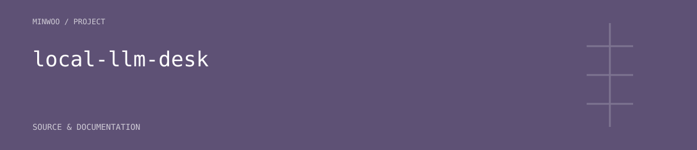

# Free AI Scheduler

<!-- PROJECT-PRESENTATION:START -->
<a href="https://github.com/minwoo19930301/local-llm-desk"></a>

[](https://github.com/minwoo19930301/local-llm-desk)
<!-- PROJECT-PRESENTATION:END -->

각 사람 맥에서 Ollama로 로컬 모델을 받고, cron 자동화로 돌린다.

사람마다 HOME·경로가 다르다. crontab에 사용자 이름이나 `/Users/누구`를 넣지 않는다. `desk/cron_wrap.sh`가 자기 위치를 기준으로 실행한다.

```zsh
git clone <이 저장소>
cd local-llm-desk
./start.sh
```

1. `/` 에서 스펙을 본 뒤 `/install` 에서 프로바이더를 받고 `/install/models` 에서 모델을 받는다.
2. `/jobs` 목록에서 잡을 넣고, 지금 실행해보기 → 되면 시각을 정해 반복한다.

Ollama는 Homebrew 없이 공식 앱으로 받는다.

- http://127.0.0.1:8788/

Ollama와 모델은 맥마다 따로 받는다. 회사 공용 한 대가 아니라, 각자 맥에서 같은 도구를 돌리는 방식이다.
